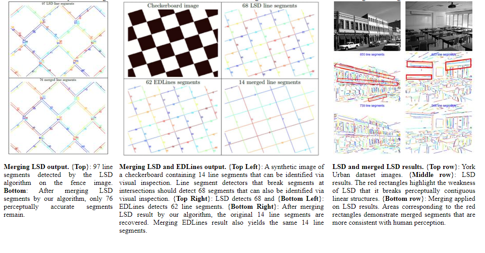
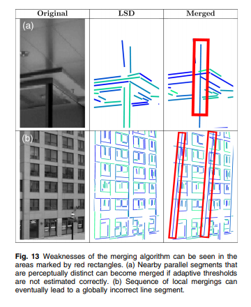

# EDM: ED_lib + Mergeline for edge detection
&emsp;&emsp;Use C++ rewrite 'merge' part of algorithm 'LSM', original 'LSM' algorithm write by matlab, speed too slow, this algorithm compatible 'LSD' and '[EDLine](https://github.com/CihanTopal/ED_Lib)' algorithm output pointset to merge lines. 

## Abstract
&emsp;&emsp;Existing line segment detectors tend to break up perceptually distinct line segments into multiple segments. We propose an algorithm for merging such broken segments to recover the original perceptually accurate line segments. The algorithm proceeds by grouping line segments on the basis of angular and spatial proximity. Then those line segment pairs within each group that satisfy novel, adaptive mergeability criteria are successively merged to form a single line segment. This process is repeated until no more line segments can be merged. 

## Methodology
&emsp;&emsp;EDM algorithm reference 'merge' part of algorithm 'LSM'.This algorithm takes as input an image and line segments detected by an off-the-shelf line segment detector. The merging pipeline has two main steps. In the first step, we group line segments based on traditional measures of spatial and angular proximity:
1. Spatial proximity: Line segments must be spatially close enough to be grouped.
2. Angular proximity: Orientation of line segments should not be much different from each other.

Algorithm flow、code and explanation can reference this paper:

[Paper: Naila Hamid, Nazar Khan, “LSM: perceptually accurate line segment merging,” J. Electron. Imaging 25(6), 061620 (2016), doi: 10.1117/1.JEI.25.6.061620](http://faculty.pucit.edu.pk/nailah/research/LSM/Line%20Segment%20Merging%20(LSM).pdf)

## Results:
### Merge success

### Merge error
&emsp;&emsp;(a) Nearby parallel segments thatare perceptually distinct can become merged if adaptive thresholds are not estimated correctly. (b) Sequence of local mergings can eventually lead to a globally incorrect line segment

## Use instruction
&emsp;&emsp;Include "Merge.h" and contain "Merge.cpp" to your project.

**EDLine merge:**

    // Detection of line segments from the same image
    EDLines testEDLines = EDLines(testImg);
    // Acquiring line information, i.e. start & end points
    vector<LS> lines = testEDLines.getLines();
    // Instantiation merge object
    Merge ml;
    // Get merge line result 
    vector<LS> result_lines = ml.MergeLine(lines, M_PI / 12, .05);

**LSD merge:**

    // Create LSD output lines end-points with struct 'LS'
    vector<LS> lines;
    // Instantiation merge object
    Merge ml;
    // Get merge line result 
    vector<LS> result_lines = ml.MergeLine(lines, M_PI / 12, .05);

## TODO
- [] Merge line with Ransac algorithm to reduce merge error
